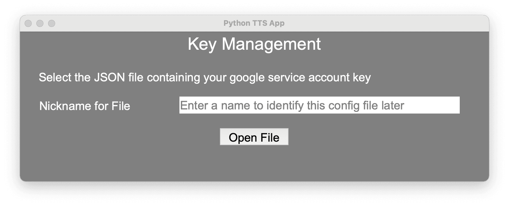

# Python-TTS-App

## Setting Up the App with Amazon Polly

Follow these steps to set up your app with Amazon Polly:

### 1. Sign up for an AWS Account
- Go to the [AWS Sign Up Page](https://aws.amazon.com) and sign up for a new account.
- **Note**: Signing up requires a credit card. A fee of **USD $1** will be charged during the sign-up process, but this amount will be refunded.

### 2. Enable Polly Service
- After signing up, log in to your AWS Management Console.
- Navigate to the **Polly** service (you can search for **Polly** in the search bar).
- Enable the service to start using Amazon Polly's Text-to-Speech functionality.

### 3. Create IAM User with Programmatic Access
- Go to the **IAM** (Identity and Access Management) service in the AWS console.
- Click on **Users** in the left-hand menu, then click on **Add user**.
- Enter a username for your new IAM user (e.g., `pollyUser`).
- Under **Access type**, select **Programmatic access**.
- Click **Next: Permissions**.

### 4. Assign Permissions to the IAM User
- On the **Set Permissions** page, select **Attach policies directly**
- Add the following permissions
   - AmazonPollyFullAccess
   - ServiceQuotasFullAccess
   - ServiceQuotasReadOnlyAccess
- Once done, click **Next: Tags**, then click **Next: Review**.
- Finally, click **Create user**.

### 5. Save the AWS Credentials
- After the IAM user is created, click on the newly created user from the users page.
- Navigate to **security credentials**, then click **Create Access Key**.
- Select **Application running outside AWS** and click Next.
- In the following page, click **Create access key**.
- The keys will be displayed in the following page.
- **Important**: Store these credentials securely.

## Setting Up the App with Google Cloud 

Follow these steps to set up your app with Google Cloud TTS:

### 1. Create a Google Account (If you don't have one)
- Go to the [Google Sign Up Page](https://accounts.google.com/signup) and create a new Google account.

### 2. Access Google Cloud Console
- Go to the [Google Cloud Console](https://console.cloud.google.com/).
- **Sign in** with your Google account.

### 3. Create a New Project
- In the **Google Cloud Console**, click on the **project dropdown** in the top navigation bar.
- Select **“New Project”**.
- **Give the project a name** and click **Create**.

### 4. Enable Text-to-Speech API
- In the **Google Cloud Console**, search for **“Text-to-Speech API”** in the search bar or navigate directly to the [Text-to-Speech API Page](https://console.cloud.google.com/apis/library/texttospeech.googleapis.com).
- Click on the **"Enable"** button to enable the Text-to-Speech API for your project.

### 5. Set Up Billing
- Go to the [Google Cloud Billing Page](https://console.cloud.google.com/billing).
- **Link a billing account** or add a **credit card**. 
- **Note**: Billing is required even for the **free tier** usage of Google Cloud services.

### 6. Create a Service Account
- Go to the [Service Accounts Page](https://console.cloud.google.com/iam-admin/serviceaccounts) in the Google Cloud Console.
- Click on **“Create Service Account”** and provide it a **name**.
- Click **Create and Continue**.

### 7. Assign Roles to Service Account
- In the **Create Service Account** wizard, assign the **Owner** role to the service account.
- Click **Done**.

### 8. Generate Service Account Key
- After creating the service account, find it in the **Service Account list**.
- Click the **three-dot menu** next to the service account, then select **“Manage keys”**.
- Click **“Add Key”** → **“Create New Key”**.
- Choose **JSON** as the key type, then click **Create**.

### 9. Download the Key File
- The key file will be downloaded automatically as a **JSON file**.
- **Important**: Store this key file securely as it contains sensitive information for authenticating with Google Cloud services.

---

## Using the Application

 

 **Download the `Python TTS.app` File**:
   - Download the latest version of **`Python TTS.app`** file from the provided [link](https://github.com/Ponharish/Python-TTS-App/releases/tag/Week_4).
   - **Double-click** the `.app` file to open it.

 **Choosing your Engine**:
  
   - Upon opening the app, a window will pop up asking for **TTS Service to be used**.
   - Select the desired service and click **Next**.

--- 

### Using Polly TTS
1. 
     - **AWS Access Key**: Your **Access Key ID** from the AWS IAM user you created.
     - **AWS Secret Key**: Your **Secret Access Key** associated with the IAM user.

2. **Main Page**:
   - Upon completing the registration, the main page will load
   

3. **Convert Text to Speech**:
  - In the main page, first select the region that is to be used
   
  - Then specify the **Engine** to be used (Standard or Neural)
    - **Standard Engine**: This engine uses a basic synthetic voice that may sound more robotic. It's efficient and works for most basic speech needs.
    - **Neural Engine**: This engine provides a more **natural-sounding voice** that is much closer to human speech, offering better intonation and fluidity.
  - Choose the **language** of the text that is to be converted to speech. The list of available languages shown is based on the selected region and engine.
  - Choose the **voice** that would read the given text. The list of available voices shown is based on the selected region, engine and language.
  - Choose the **Input Text Type**:
    - **Text**: Normal text that will be read aloud **as-is**, without any special processing.
    - **SSML (Speech Synthesis Markup Language)**: This option allows you to use **SSML** tags to control the speech characteristics like pauses, pitch, and volume. The input will be processed before converting to speech.
  - Enter the Text to be Converted to Speech:
    - Type in the **text** (or SSML) that you want to be converted to speech. This is the content that will be spoken aloud by Amazon Polly.

  - **Click on Submit**:
  
    - After entering all the necessary details, click on the **"Submit"** button.
    - The app will generate the audio and **play it through your speakers**.

4. **Signing in as another user or using another TTS service**:
  - Click on **Reconfigure Keys**, which will open up the window for choosing the TTS service. Using this window, the new keys can be entered or the TTS service can be changed.

#### Troubleshooting
 

Credential Registration Page
 
- **Invalid AWS Access Key**:  
  Ensure that the **AWS Access Key** entered is **valid**. Double-check that there are **no extra spaces or incorrect characters** before or after the key.

- **Invalid AWS Secret Key**:  
  Verify that the **AWS Secret Key** is correct. Make sure there are **no extra spaces** or **incorrect characters** in the key, especially at the start or end.

Main Page

- **Input Text is Too Long**:  
  This TTS service has a limit of **2990 characters** for the text input. If the provided input exceeds this limit, you will see an error message prompting you to shorten the text.

- **Empty Text Field**:  
  Make sure that the **text field** is not empty. The app will not proceed if no text is provided to convert into speech.

- **Invalid SSML Input**:  
  This error occurs only if **SSML** is selected as the input type. The input must be a **valid SSML format**. Ensure that SSML tags (e.g., `<speak>`, `<break time="500ms"/>`) are properly structured and closed.

---

### Using Google Cloud TTS
1. 
     - Once the above page loads, click on **Open File** and open the **.json** file containing the key.

2. **Main Page**:
   - Upon completing the registration, the main page will load
   

3. **Convert Text to Speech**:
  - In the main page, first select the language that is to be used
  - Then specify the **Engine** to be used (The list of available engines are loaded after languages are selected. Note: A particular language may not support all engines)
    - **Standard**: Basic synthetic voice with robotic tone; fast and efficient.
    - **Casual**: Conversational and relaxed tone, ideal for chatbots.
    - **Chirp-HD**: High-definition, expressive voice with clear articulation.
    - **Chirp3-HD**: Next-gen HD voice with enhanced emotional expression.
    - **Neural2**: Advanced neural voice with smooth, natural intonation.
    - **News**: Professional tone optimized for reading news content.
    - **Polyglot**: Multilingual voice capable of fluent speech across languages.
    - **Studio**: Studio-grade voice suitable for production-quality output.
    - **Wavenet**: Realistic voice with deep learning-based expressiveness.

  - Choose the **Gender** of the voice that would read the text.
  - Choose the **voice** that would read the given text. The list of available voices shown is based on the selected language, engine and gender.
  - Choose the **Input Text Type**:
    - **Text**: Normal text that will be read aloud **as-is**, without any special processing.
    - **SSML (Speech Synthesis Markup Language)**: This option allows you to use **SSML** tags to control the speech characteristics like pauses, pitch, and volume. The input will be processed before converting to speech.
  - Enter the Text to be Converted to Speech:
    - Type in the **text** (or SSML) that you want to be converted to speech. This is the content that will be spoken aloud by Google Cloud TTS.

  - **Click on Submit**:
    - After entering all the necessary details, click on the **"Submit"** button.
    - The app will generate the audio and **play it through your speakers**.

4. **Signing in as another user or using another TTS service**:
  - Click on **Reconfigure Keys**, which will open up the window for choosing the TTS service. Using this window, the new keys can be loaded or the TTS service can be changed.

#### Troubleshooting
 

Credential Registration Page
 
- **Invalid Key**:  
  Ensure that the **.json** file is the correct file and is not corrupted.

Main Page

- **Input Text is Too Long**:  
  This TTS service has a limit of **4990 characters** for the text input. If the provided input exceeds this limit, you will see an error message prompting you to shorten the text.

- **Empty Text Field**:  
  Make sure that the **text field** is not empty. The app will not proceed if no text is provided to convert into speech.

---

### Using OS Native TTS
1. After selecting **Os Native TTS** in Service Selection Page, the main page will load.

2. **Main Page**:
   

3. **Convert Text to Speech**:
  - In the main page, first select the language that is to be used
  - Then choose the **voice** that would read the given text. The list of available voices shown is based on the selected language.
  - Enter the Text to be Converted to Speech:
    - Type in the **text**  that you want to be converted to speech. This is the content that will be spoken aloud by TTS.

  - **Click on Submit**:
    - After entering all the necessary details, click on the **"Submit"** button.
    - The app will generate the audio file and ask for a location to save the file. Once saved, you can find the audio file at the specified location.
     <b>Important:</b> Unlike the previous 2 TTS services, the app does not provide live playing of the audio generated.

4. **Using another TTS service**:
  - Click on **Reconfigure Keys**, which will open up the window for choosing the TTS service.

---

## Target Users

- **Content Creators**
  - YouTubers, vloggers, and influencers who want to create voiceovers **without using their own voice** for reasons such as **anonymity** or **personal comfort**.
  - Ideal for creators who want a consistent voice across videos, even when they're unavailable to record.

- **Podcast Creators & Audiobook Producers**
  - Those producing **narrated content at scale**, and want to experiment with voices and tone before committing to human narration or TTS.

- **Marketers**
  - Creating promotional or explainer videos with engaging, natural-sounding narration.
  - Useful for ad campaigns, product launches, and landing page content.

- **Educators**
  - Making instructional content, tutorials, or e-learning modules using TTS.
  - Allows for multilingual delivery and consistent voiceover tone.

- **Developers**
  - Building applications or tools with built-in text-to-speech features.
  - Can test various TTS APIs and integrate voices into apps, chatbots, or virtual assistants.

- **People Who Prefer Listening Over Reading**
  - Those who enjoy consuming **long-form content (blogs, articles, books)** by listening.
  - Users with **visual impairments**, reading fatigue, or accessibility needs.

- **Language Learners**
  - Users practicing pronunciation or listening comprehension in new languages.
  - Can test multiple accents and speeds to improve fluency.

## Value Proposition

- **Centralized Platform**
  - Explore and compare voices from multiple TTS engines (Google, AWS Polly, native OS) in one place.

- **Time-Saving Features**
  - Smart filters for language, voice, gender, and engine type.
  - Live previews of audio.

- **Cost-Efficient Usage**
  - Monitor and track character usage.
  - Make the most of free tiers before upgrading.

- **Cross-Platform**
  - Works seamlessly on **Windows**, **macOS**, and **Linux (x86 architecture)**.
  - Packaged desktop app with no hosting costs or browser dependency.

- **Customizable Outputs**
  - Support for SSML (Speech Synthesis Markup Language). Using SSML voice speed, pitch, volume, and style (e.g., formal, cheerful) can be modified

- **User-Friendly Interface**
  - Designed for non-technical users with an intuitive GUI.
  - Dropdown inputs, radio inputs, file saving dialogs, and voice previews.

- **Voice Discovery & Comparison**
  - Easily compare different voices side-by-side.
  - Test same text across engines for quality evaluation.

- **Accessible Design**
  - Useful for users with reading difficulties.

- **No Vendor Lock-In**
  - Supports multiple APIs and lets users bring their own keys.
  - Easy to switch providers.

- **Secure Key Handling**
  - Store API keys locally and securely.
  - Keys are never transmitted or shared.

## Core Features

- **Voice Discovery & Comparison**
  - Preview voices from multiple providers (Google, AWS Polly, native OS).
  - Filter voices by language, gender, engine.
  - Compare voices by playing the same text in different voices.

- **Voice Configuration**
  - Use SSML to add pauses, emphasis, and pronunciation corrections and also adjust voice attributes such as speed, pitch, and volume.

- **Free Tier Quota Management** (Only available for Polly)
  - Track character usage per engine/account.

- **Key & Account Management**
  - Add and manage API keys through a simple GUI.
  - Store credentials securely and locally.

- **Offline Capabilities**
  - Use OS-native TTS for offline voice generation.

- **Cross-Platform Support**
  - Compatible with Windows, macOS, and Linux (x86 architecture).
  - Packaged using PyInstaller

## Future Roadmap
  - SSML Assistant.
  - AI Integration for spelling and grammer check.
  - Support for custom voice cloning and training.
  - Browser extension to send text to the app directly.

